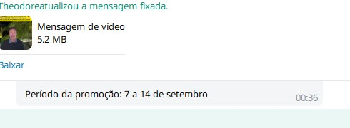
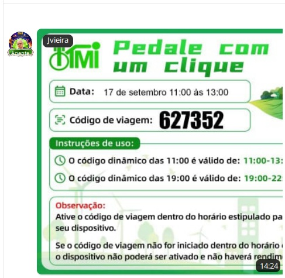
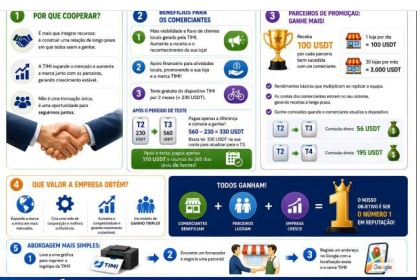
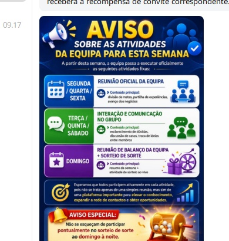
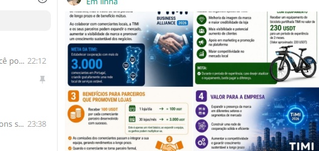
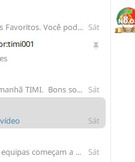

# 🏛️ Base de Conhecimento Operacional TIMI — Comunicações Oficiais

> **Repositório Oficial:** [ApexScorpio/bonchat-intel-agent](https://github.com/ApexScorpio/bonchat-intel-agent)  
> **Finalidade:** Registo histórico permanente, 100% inalterado e auditável de todas as mensagens, cartazes, diretivas e campanhas partilhadas pelas autoridades oficiais da TIMI (**Theodore**, **Jonathan / TIMI-Jonathan**, **Márcia** e canal oficial **TIMI--NO.08**).  
> **Uso:** Consulta interna para agentes em campo, pesquisa rápida de regras e histórico de incentivos sem necessidade de gastar quota de IA.

---

## 📑 Índice Rápido de Comunicações

| ID | Data / Hora | Grupo / Canal | Autoridade | Assunto Principal | Anexo Visual |
|---|---|---|---|---|:---:|
| `INTEL-20260928-085` | 2026-09-07 23:12 | `TIMI PORTUGAL DREAM TEAM` | TIMI--NO.08 | Aviso / Diretiva | [Ver Anexo](#intel-20260928-085) |
| `INTEL-20260928-084` | 2026-09-28 10:19 | `TIMI PORTUGAL DREAM TEAM` | Silvestre Bettencourt Huerta | Resposta / Diretiva | [Ver Anexo](#intel-20260928-084) |
| `INTEL-20260928-083` | 2026-09-28 10:18 | `TIMI PORTUGAL DREAM TEAM` | Joana | Dúvida | [Ver Anexo](#intel-20260928-083) |
| `INTEL-20260928-082` | 2026-09-28 10:17 | `TIMI PORTUGAL DREAM TEAM` | TIMI--NO.08 | Aviso / Diretiva | [Ver Anexo](#intel-20260928-082) |
| `INTEL-20260928-081` | 2026-09-03 20:22 | `Equipa de Agentes de Elite da TIMI` | Theodore | Aviso / Reunião / Bónus / Diretiva | [Ver Anexo](#intel-20260928-081) |
| `INTEL-20260928-080` | 2026-09-03 19:45 | `Equipa de Agentes de Elite da TIMI` | Theodore | Aviso / Reunião / Diretiva | [Ver Anexo](#intel-20260928-080) |
| `INTEL-20260928-079` | 2026-09-03 19:26 | `Equipa de Agentes de Elite da TIMI` | Paulo | Geral / Cumprimento | [Ver Anexo](#intel-20260928-079) |
| `INTEL-20260928-078` | 2026-09-03 15:27 | `Equipa de Agentes de Elite da TIMI` | Pedro Peters | Resposta / Agradecimento | [Ver Anexo](#intel-20260928-078) |
| `INTEL-20260928-077` | 2026-09-03 14:22 | `Equipa de Agentes de Elite da TIMI` | Pedro Peters | Resposta / Agradecimento | [Ver Anexo](#intel-20260928-077) |
| `INTEL-20260928-076` | 2026-09-03 14:25 | `Equipa de Agentes de Elite da TIMI` | RBP | Geral / Congratulação | [Ver Anexo](#intel-20260928-076) |
| `INTEL-20260928-075` | 2026-09-03 14:15 | `Equipa de Agentes de Elite da TIMI` | Theodore | Bónus / Promoção | [Ver Anexo](#intel-20260928-075) |
| `INTEL-20260928-074` | 2026-09-03 13:03 | `Equipa de Agentes de Elite da TIMI` | Santiago | Geral / Informação | [Ver Anexo](#intel-20260928-074) |
| `INTEL-20260928-073` | 2026-09-03 14:45 | `Equipa de Agentes de Elite da TIMI` | Theodore | Diretiva | [Ver Anexo](#intel-20260928-073) |
| `INTEL-20260928-072` | 2026-09-03 14:44 | `Equipa de Agentes de Elite da TIMI` | Theodore | Diretiva / Ferramenta | [Ver Anexo](#intel-20260928-072) |
| `INTEL-20260928-071` | 2026-09-03 14:44 | `Equipa de Agentes de Elite da TIMI` | Theodore | Diretiva / Novidade de Funcionamento | [Ver Anexo](#intel-20260928-071) |
| `INTEL-20260928-070` | 2026-09-06 23:18 | `Equipa de Agentes de Elite da TIMI` | Theodore | Campanha / Bónus / Diretiva | [Ver Anexo](#intel-20260928-070) |
| `INTEL-20260928-069` | 2026-09-06 10:52 | `Equipa de Agentes de Elite da TIMI` | Theodore | Aviso / Bónus / Diretiva | [Ver Anexo](#intel-20260928-069) |
| `INTEL-20260928-068` | 2026-09-28 16:53 | `Equipa de Agentes de Elite da TIMI` | Theodore | Diretiva / Formação | [Ver Anexo](#intel-20260928-068) |
| `INTEL-20260928-067` | 2026-09-28 11:52 | `Equipa de Agentes de Elite da TIMI` | Theodore | Diretiva / Geral | [Ver Anexo](#intel-20260928-067) |
| `INTEL-20260928-066` | 2026-09-28 00:27 | `Equipa de Agentes de Elite da TIMI` | Theodore | Campanha / Diretiva | [Ver Anexo](#intel-20260928-066) |
| `INTEL-20260928-065` | 2026-09-02 11:33 | `TIMI--NO.08` | Xinha | Explicação / Campanha | [Ver Anexo](#intel-20260928-065) |
| `INTEL-20260928-064` | 2026-09-02 11:33 | `TIMI--NO.08` | TIMI PORTUGAL DREAM TEAM | Aviso / Campanha | [Ver Anexo](#intel-20260928-064) |
| `INTEL-20260928-063` | 2026-09-02 14:15 | `TIMI--NO.08` | Rui Santos | Geral | [Ver Anexo](#intel-20260928-063) |
| `INTEL-20260928-062` | 2026-09-02 12:51 | `TIMI--NO.08` | Equipa TIMI (Cartaz Promocional) | Diretiva | [Ver Anexo](#intel-20260928-062) |
| `INTEL-20260928-061` | 2026-09-02 12:51 | `TIMI--NO.08` | Sílvia Diogo | Aviso | [Ver Anexo](#intel-20260928-061) |
| `INTEL-20260928-060` | 2026-09-02 19:36 | `TIMI--NO.08` | Rui Santos | Aviso | [Ver Anexo](#intel-20260928-060) |
| `INTEL-20260928-059` | 2026-09-02 14:16 | `TIMI--NO.08` | Rui Santos | Diretiva | [Ver Anexo](#intel-20260928-059) |
| `INTEL-20260928-058` | 2026-09-02 13:39 | `TIMI--NO.08` | Rui Santos | Diretiva / Geral | [Ver Anexo](#intel-20260928-058) |
| `INTEL-20260927-057` | 2026-09-27 22:40 | `TIMI-68` | Aline | Geral | [Ver Anexo](#intel-20260927-057) |
| `INTEL-20260927-056` | 2026-09-27 22:40 | `TIMI-68` | Andreia | Geral | [Ver Anexo](#intel-20260927-056) |
| `INTEL-20260927-055` | 2026-09-27 22:39 | `TIMI-68` | Denis Cabral | Geral | [Ver Anexo](#intel-20260927-055) |
| `INTEL-20260927-054` | 2026-09-27 22:39 | `TIMI-68` | Miguel Libanio | Diretiva | [Ver Anexo](#intel-20260927-054) |
| `INTEL-20260927-053` | 2026-09-27 22:39 | `TIMI-68` | Salomé | Geral | [Ver Anexo](#intel-20260927-053) |
| `INTEL-20260927-052` | 2026-09-27 22:39 | `TIMI-68` | Jo Rodrigues | Geral | [Ver Anexo](#intel-20260927-052) |
| `INTEL-20260927-051` | 2026-09-27 22:38 | `TIMI-68` | Rafael Lima | Geral | [Ver Anexo](#intel-20260927-051) |
| `INTEL-20260927-050` | 2026-09-27 22:38 | `TIMI-68` | Marco | Geral | [Ver Anexo](#intel-20260927-050) |
| `INTEL-20260927-049` | 2026-09-27 22:38 | `TIMI-68` | Salomé | Geral | [Ver Anexo](#intel-20260927-049) |
| `INTEL-20260927-048` | 2026-09-27 22:38 | `TIMI-68` | Rafael Lima | Geral | [Ver Anexo](#intel-20260927-048) |
| `INTEL-20260927-047` | 2026-09-27 22:38 | `TIMI-68` | Salomé | Geral | [Ver Anexo](#intel-20260927-047) |
| `INTEL-20260927-046` | 2026-09-27 22:37 | `TIMI-68` | Aline | Geral | [Ver Anexo](#intel-20260927-046) |
| `INTEL-20260927-045` | 2026-09-27 09:30 | `TIMI-68` | Pro Dos Santos | Resposta | [Ver Anexo](#intel-20260927-045) |
| `INTEL-20260927-044` | 2026-09-27 09:25 | `TIMI-68` | Agracia Costa | Resposta | [Ver Anexo](#intel-20260927-044) |
| `INTEL-20260927-043` | 2026-09-27 09:20 | `TIMI-68` | Pro Dos Santos | Resposta | [Ver Anexo](#intel-20260927-043) |
| `INTEL-20260927-042` | 2026-09-27 09:15 | `TIMI-68` | David | Campanha | [Ver Anexo](#intel-20260927-042) |
| `INTEL-20260927-041` | 2026-09-27 09:10 | `TIMI-68` | Jeche Sebastiao | Geral | [Ver Anexo](#intel-20260927-041) |
| `INTEL-20260927-040` | 2026-09-27 09:05 | `TIMI-68` | Nataliina Dos Reis | Campanha | [Ver Anexo](#intel-20260927-040) |
| `INTEL-20260927-039` | 2026-09-27 09:00 | `TIMI-68` | Shirley | Resposta | [Ver Anexo](#intel-20260927-039) |
| `INTEL-20260927-038` | 2026-09-26 22:51 | `TIMI-68` | Daisy | Geral | [Ver Anexo](#intel-20260927-038) |
| `INTEL-20260927-037` | 2026-09-27 23:00 | `TIMI-68` | Agente de Campo / Membro | Campanha | [Ver Anexo](#intel-20260927-037) |
| `INTEL-20260927-036` | 2026-09-27 23:00 | `TIMI-68` | Agente de Campo / Membro | Geral | [Ver Anexo](#intel-20260927-036) |
| `INTEL-20260927-035` | 2026-09-27 23:04 | `TIMI-68` | TIMI--NO.08 | Diretiva / Geral | [Ver Anexo](#intel-20260927-035) |
| `INTEL-20260927-034` | 2026-09-27 Desconhecido | `TIMI-68` | Shirley | Geral | [Ver Anexo](#intel-20260927-034) |
| `INTEL-20260927-033` | 2026-09-27 23:22 | `TIMI-68` | Filipa Pires | Geral | [Ver Anexo](#intel-20260927-033) |
| `INTEL-20260927-032` | 2026-09-27 23:21 | `TIMI-68` | Rafael Lima | Resposta | [Ver Anexo](#intel-20260927-032) |
| `INTEL-20260927-031` | 2026-09-27 23:20 | `TIMI-68` | Anna Patterson | Geral | [Ver Anexo](#intel-20260927-031) |
| `INTEL-20260927-030` | 2026-09-27 09:00 | `TIMI--NO.08` | TIMI--NO.08 | Aviso / Sorteio Oficial | [Ver Anexo](#intel-20260927-030) |
| `INTEL-20260927-029` | 2026-09-17 01:04 | `Theodore` | Theodore | Diretiva / Onboarding | [Ver Anexo](#intel-20260927-029) |
| `INTEL-20260927-028` | 2026-09-17 01:00 | `Theodore` | Leonor | Resposta | [Ver Anexo](#intel-20260927-028) |
| `INTEL-20260927-027` | 2026-09-17 00:57 | `Theodore` | Theodore | Diretiva / Onboarding | [Ver Anexo](#intel-20260927-027) |
| `INTEL-20260927-026` | 2026-09-17 00:44 | `Theodore` | Leonor | Resposta | [Ver Anexo](#intel-20260927-026) |
| `INTEL-20260927-025` | 2026-09-17 00:41 | `Theodore` | Theodore | Diretiva / Onboarding | [Ver Anexo](#intel-20260927-025) |
| `INTEL-20260927-024` | 2026-09-17 00:40 | `Theodore` | Leonor | Geral | [Ver Anexo](#intel-20260927-024) |
| `INTEL-20260927-023` | 2026-09-17 00:40 | `Theodore` | Leonor | Geral | [Ver Anexo](#intel-20260927-023) |
| `INTEL-20260927-022` | 2026-09-17 00:39 | `Theodore` | Theodore | Geral | [Ver Anexo](#intel-20260927-022) |
| `INTEL-20260927-021` | 2026-09-17 15:38 | `Theodore` | TIMI--NO.08 | Diretiva / Aviso | [Ver Anexo](#intel-20260927-021) |
| `INTEL-20260927-020` | 2026-09-17 14:30 | `TIMI--NO.08` | Márcia | Orientação de Chefia | [Ver Anexo](#intel-20260927-020) |
| `INTEL-20260927-019` | 2026-09-16 09:05 | `TIMI--NO.08` | TIMI--NO.08 | Campanha / Diretiva Operacional | [Ver Anexo](#intel-20260927-019) |
| `INTEL-20260927-018` | 2026-09-16 09:00 | `TIMI--NO.08` | TIManualizou | Aviso de Sistema / Sorteio | [Ver Anexo](#intel-20260927-018) |
| `INTEL-20260927-017` | 2026-09-27 22:16 | `TIMI-68` | Theodore | Diretiva | [Ver Anexo](#intel-20260927-017) |
| `INTEL-20260927-016` | 2026-09-27 22:17 | `TIMI-68` | TIMI Oficial | Campanha | [Ver Anexo](#intel-20260927-016) |
| `INTEL-20260927-015` | 2026-09-27 22:17 | `TIMI-68` | Theodore | Diretiva | [Ver Anexo](#intel-20260927-015) |
| `INTEL-20260927-014` | 2026-09-27 22:19 | `TIMI-68` | Theodore | Informação | [Ver Anexo](#intel-20260927-014) |
| `INTEL-20260927-013` | 2026-09-27 22:20 | `TIMI-68` | Theodore | Diretiva / Confirmação | [Ver Anexo](#intel-20260927-013) |
| `INTEL-20260927-012` | 2026-09-27 22:20 | `TIMI-68` | Theodore | Diretiva / Aviso | [Ver Anexo](#intel-20260927-012) |
| `INTEL-20260907-002` | 07 de Setembro de 2026 00:36 | `Teodoro.Grupo de Agentes20` | Theodore | Vídeo e Campanha Promocional Fixada | [Ver Anexo](#intel-20260907-002) |
| `INTEL-20260907-001` | 07 de Setembro de 2026 20:00 (Hora de Portugal) | `TIMI--NO.08` | Jonathan (Gerente Geral da TIMI) | Aviso Oficial de Reunião Obrigatória | [Ver Anexo](#intel-20260907-001) |
| `INTEL-20260914-001` | 14 de Setembro de 2026 14:45 | `Grupo de reuniões` | Theodore | Campanha Oficial de Empréstimo e Bónus | [Ver Anexo](#intel-20260914-001) |
| `INTEL-20260917-001` | 17 de Setembro de 2026 14:24 (Válido: 11h-13h e 19h-22h) | `TIMI--NO.08` | TIMI Oficial | Código de Viagem Dinâmico (Pedale com um clique) | [Ver Anexo](#intel-20260917-001) |
| `INTEL-20260925-001` | 25 de Setembro de 2026 Manhã | `TIMI--NO.08` | TIMI Oficial | Mensagem Fixada / Sorteio Diário | [Ver Anexo](#intel-20260925-001) |
| `INTEL-20260925-002` | 25 de Setembro de 2026 14:27 | `TIMI--NO.08` | TIMI Oficial | Infográfico Oficial de Parcerias e Comissões USDT | [Ver Anexo](#intel-20260925-002) |
| `INTEL-20260925-003` | 25 de Setembro de 2026 21:15 / 23:21 | `Theodore` | Theodore | Diretiva de Recrutamento T4, Bónus de $80 e Pontos | [Ver Anexo](#intel-20260925-003) |
| `INTEL-20260925-004` | 25 de Setembro de 2026 Noite | `Theodore` | Theodore | Agenda Semanal Oficial de Atividades da Equipa | [Ver Anexo](#intel-20260925-004) |
| `INTEL-20260925-005` | 25 de Setembro de 2026 23:37 | `Theodore` | Theodore | Campanha Business Alliance 2026 e Expansão | [Ver Anexo](#intel-20260925-005) |
| `INTEL-20260926-001` | 26 de Setembro de 2026 15:38 | `TIMI-NeWs` | TIMI--NO.08 | Sessão TIMI de Aprendizagem (Plano de Desenvolvimento e Visão) | [Ver Anexo](#intel-20260926-001) |
| `INTEL-20260926-002` | 26 de Setembro de 2026 23:34 | `TIMI--NO.08` | TIMI Oficial | Mensagem Fixada / Sorteio Diário | [Ver Anexo](#intel-20260926-002) |

---

## 📌 Registos Integrais (100% Inalterados)

---

### <a id="intel-20260928-085"></a>[INTEL-20260928-085] — Aviso / Diretiva

- **📅 Data de Publicação:** 2026-09-07
- **⏰ Hora:** 23:12
- **👥 Grupo / Canal:** `TIMI PORTUGAL DREAM TEAM`
- **👑 Autoridade / Emissor:** `TIMI--NO.08`
- **🏷️ Categoria:** Aviso / Diretiva
#### 📝 Conteúdo Literal 100% Inalterado:
```text
A TIMI promove uma visão de mobilidade verde, partilhada, prática e económica. Com soluções de transporte mais flexíveis, ajudamos a reduzir custos e desperdícios, tornando a mobilidade urbana mais leve, eficiente e sustentável.

Como uma das patrocinadoras do evento, a TIMI levou as suas bicicletas partilhadas e elétricas a Pinhal Novo, onde também deu uma entrevista à comunicação social presente.

Acreditamos que a mobilidade partilhada não é só um meio de transporte, mas também uma forma de vida mais inteligente e sustentável.

A TIMI continua a expandir-se no mercado local, integrando a mobilidade verde em mais comunidades e no dia a dia das pessoas. Esperamos contar com mais parceiros para explorar juntos as novas possibilidades da mobilidade urbana.

Convidamos todos os parceiros a partilhar nas vossas redes sociais (Facebook, Instagram, YouTube, TikTok) o nosso stand e a experiência com os produtos, para que mais pessoas possam ver a TIMI!

Festa das Vindimas de Palmela | Stand TIMI perto do palco principal
#EntrevistaMedia #ExperiênciaProduto #MobilidadeVerde #FuturoPartilhado
```

#### 💡 Pontos-Chave:
- TIMI promove mobilidade verde, partilhada, prática e económica.
- TIMI é patrocinadora e esteve presente na Festa das Vindimas de Palmela (Pinhal Novo).
- Apresentou bicicletas partilhadas e elétricas e deu entrevista à comunicação social.
- Expansão no mercado local e procura por novos parceiros.
- Apelo a parceiros para partilharem o stand e produtos TIMI nas redes sociais.

---

### <a id="intel-20260928-084"></a>[INTEL-20260928-084] — Resposta / Diretiva

- **📅 Data de Publicação:** 2026-09-28
- **⏰ Hora:** 10:19
- **👥 Grupo / Canal:** `TIMI PORTUGAL DREAM TEAM`
- **👑 Autoridade / Emissor:** `Silvestre Bettencourt Huerta`
- **🏷️ Categoria:** Resposta / Diretiva
#### 📝 Conteúdo Literal 100% Inalterado:
```text
Joana Bom dia queria perguntar porque ainda não recebi o pagame... Não se preocupe o pagamento de quinta-feira vai cair amanhã depois das 22h porque cada transferência demora mais de 72 horas
```

#### 💡 Pontos-Chave:
- Pagamento de quinta-feira será processado amanhã (após 22h)
- Transferências podem demorar mais de 72 horas

---

### <a id="intel-20260928-083"></a>[INTEL-20260928-083] — Dúvida

- **📅 Data de Publicação:** 2026-09-28
- **⏰ Hora:** 10:18
- **👥 Grupo / Canal:** `TIMI PORTUGAL DREAM TEAM`
- **👑 Autoridade / Emissor:** `Joana`
- **🏷️ Categoria:** Dúvida
#### 📝 Conteúdo Literal 100% Inalterado:
```text
Bom dia queria perguntar porque ainda não recebi o pagamento de quinta-feira
```

#### 💡 Pontos-Chave:
- Questão sobre pagamento de quinta-feira não recebido

---

### <a id="intel-20260928-082"></a>[INTEL-20260928-082] — Aviso / Diretiva

- **📅 Data de Publicação:** 2026-09-28
- **⏰ Hora:** 10:17
- **👥 Grupo / Canal:** `TIMI PORTUGAL DREAM TEAM`
- **👑 Autoridade / Emissor:** `TIMI--NO.08`
- **🏷️ Categoria:** Aviso / Diretiva
#### 📝 Conteúdo Literal 100% Inalterado:
```text
TIMI--NO.08 atualizou a mensagem fixada. Regras de Ganhos e Levantamento para Parceiros TIMI: 1. O tempo normal de análise de pedidos de levantamento é de 24 horas. 2. O tempo máximo de análise de pedidos de levantamento é de 72 horas. 3. Não é permitido o levantamento de bónus de convite. 4. O levantamento mínimo é de 10 USDT.
```

#### 💡 Pontos-Chave:
- Regras de levantamento atualizadas
- Prazo normal de análise: 24 horas
- Prazo máximo de análise: 72 horas
- Bónus de convite não são levantáveis
- Levantamento mínimo: 10 USDT

---

### <a id="intel-20260928-081"></a>[INTEL-20260928-081] — Aviso / Reunião / Bónus / Diretiva

- **📅 Data de Publicação:** 2026-09-03
- **⏰ Hora:** 20:22
- **👥 Grupo / Canal:** `Equipa de Agentes de Elite da TIMI`
- **👑 Autoridade / Emissor:** `Theodore`
- **🏷️ Categoria:** Aviso / Reunião / Bónus / Diretiva
#### 📝 Conteúdo Literal 100% Inalterado:
```text
Todos se lembrem de avisar uns aos outros para participarem na reunião do grupo de hoje à noite a tempo! Enviarei duas recompensas de sorte. Quem participar na reunião poderá recebê-las atempadamente. Não deixem que a falta de aviso vos faça perder as vossas recompensas. Lembrem também os colegas que ainda não viram esta mensagem!
```

#### 💡 Pontos-Chave:
- Lembrete para avisar sobre reunião noturna
- Duas recompensas de sorte para participantes da reunião
- Alerta para não perder recompensas por falta de aviso
- Instrução para lembrar colegas que não viram a mensagem

---

### <a id="intel-20260928-080"></a>[INTEL-20260928-080] — Aviso / Reunião / Diretiva

- **📅 Data de Publicação:** 2026-09-03
- **⏰ Hora:** 19:45
- **👥 Grupo / Canal:** `Equipa de Agentes de Elite da TIMI`
- **👑 Autoridade / Emissor:** `Theodore`
- **🏷️ Categoria:** Aviso / Reunião / Diretiva
#### 📝 Conteúdo Literal 100% Inalterado:
```text
Todos devem informar os membros da equipa para participarem na reunião de hoje à noite a tempo!
```

#### 💡 Pontos-Chave:
- Diretiva para informar membros sobre reunião noturna
- Ênfase na participação a tempo

---

### <a id="intel-20260928-079"></a>[INTEL-20260928-079] — Geral / Cumprimento

- **📅 Data de Publicação:** 2026-09-03
- **⏰ Hora:** 19:26
- **👥 Grupo / Canal:** `Equipa de Agentes de Elite da TIMI`
- **👑 Autoridade / Emissor:** `Paulo`
- **🏷️ Categoria:** Geral / Cumprimento
#### 📝 Conteúdo Literal 100% Inalterado:
```text
Boa tarde, Agentes
```

#### 💡 Pontos-Chave:
- Saudação aos agentes

---

### <a id="intel-20260928-078"></a>[INTEL-20260928-078] — Resposta / Agradecimento

- **📅 Data de Publicação:** 2026-09-03
- **⏰ Hora:** 15:27
- **👥 Grupo / Canal:** `Equipa de Agentes de Elite da TIMI`
- **👑 Autoridade / Emissor:** `Pedro Peters`
- **🏷️ Categoria:** Resposta / Agradecimento
#### 📝 Conteúdo Literal 100% Inalterado:
```text
Obrigado 👍
```

#### 💡 Pontos-Chave:
- Agradecimento

---

### <a id="intel-20260928-077"></a>[INTEL-20260928-077] — Resposta / Agradecimento

- **📅 Data de Publicação:** 2026-09-03
- **⏰ Hora:** 14:22
- **👥 Grupo / Canal:** `Equipa de Agentes de Elite da TIMI`
- **👑 Autoridade / Emissor:** `Pedro Peters`
- **🏷️ Categoria:** Resposta / Agradecimento
#### 📝 Conteúdo Literal 100% Inalterado:
```text
Obrigado Theodore!
```

#### 💡 Pontos-Chave:
- Agradecimento a Theodore pela promoção e recompensa

---

### <a id="intel-20260928-076"></a>[INTEL-20260928-076] — Geral / Congratulação

- **📅 Data de Publicação:** 2026-09-03
- **⏰ Hora:** 14:25
- **👥 Grupo / Canal:** `Equipa de Agentes de Elite da TIMI`
- **👑 Autoridade / Emissor:** `RBP`
- **🏷️ Categoria:** Geral / Congratulação
#### 📝 Conteúdo Literal 100% Inalterado:
```text
Parabéns à nossa excelente parceira Pedro **57754, q... O caminho é sempre a subir 📈
```

#### 💡 Pontos-Chave:
- Congratulação a Pedro **57754 pela promoção

---

### <a id="intel-20260928-075"></a>[INTEL-20260928-075] — Bónus / Promoção

- **📅 Data de Publicação:** 2026-09-03
- **⏰ Hora:** 14:15
- **👥 Grupo / Canal:** `Equipa de Agentes de Elite da TIMI`
- **👑 Autoridade / Emissor:** `Theodore`
- **🏷️ Categoria:** Bónus / Promoção
#### 📝 Conteúdo Literal 100% Inalterado:
```text
Parabéns à nossa excelente parceira Pedro **57754, que com a sua persistência e dedicação conseguiu ser promovida a Agente Júnior! Ganhou 80 USDT de recompensa de promoção, e isto é apenas o começo o objetivo já está a caminho. Continua a avançar com força!
```

#### 💡 Pontos-Chave:
- Promoção de Pedro **57754 a Agente Júnior
- Recompensa de 80 USDT pela promoção
- Incentivo para continuar o trabalho e alcançar novos objetivos

---

### <a id="intel-20260928-074"></a>[INTEL-20260928-074] — Geral / Informação

- **📅 Data de Publicação:** 2026-09-03
- **⏰ Hora:** 13:03
- **👥 Grupo / Canal:** `Equipa de Agentes de Elite da TIMI`
- **👑 Autoridade / Emissor:** `Santiago`
- **🏷️ Categoria:** Geral / Informação
#### 📝 Conteúdo Literal 100% Inalterado:
```text
Salário de Agente Nível 1 recebido.
```

#### 💡 Pontos-Chave:
- Confirmação de recebimento de salário de Agente Nível 1

---

### <a id="intel-20260928-073"></a>[INTEL-20260928-073] — Diretiva

- **📅 Data de Publicação:** 2026-09-03
- **⏰ Hora:** 14:45
- **👥 Grupo / Canal:** `Equipa de Agentes de Elite da TIMI`
- **👑 Autoridade / Emissor:** `Theodore`
- **🏷️ Categoria:** Diretiva
#### 📝 Conteúdo Literal 100% Inalterado:
```text
Depois de adicionar, envia-me o teu nome de utilizador da TIML
```

#### 💡 Pontos-Chave:
- Instrução para enviar o nome de utilizador TIML após adicionar Theodore no Telegram

---

### <a id="intel-20260928-072"></a>[INTEL-20260928-072] — Diretiva / Ferramenta

- **📅 Data de Publicação:** 2026-09-03
- **⏰ Hora:** 14:44
- **👥 Grupo / Canal:** `Equipa de Agentes de Elite da TIMI`
- **👑 Autoridade / Emissor:** `Theodore`
- **🏷️ Categoria:** Diretiva / Ferramenta
#### 📝 Conteúdo Literal 100% Inalterado:
```text
https://t.me/Theodore0025113
```

#### 💡 Pontos-Chave:
- Link direto para adicionar Theodore no Telegram

---

### <a id="intel-20260928-071"></a>[INTEL-20260928-071] — Diretiva / Novidade de Funcionamento

- **📅 Data de Publicação:** 2026-09-03
- **⏰ Hora:** 14:44
- **👥 Grupo / Canal:** `Equipa de Agentes de Elite da TIMI`
- **👑 Autoridade / Emissor:** `Theodore`
- **🏷️ Categoria:** Diretiva / Novidade de Funcionamento
#### 📝 Conteúdo Literal 100% Inalterado:
```text
Boa tarde a todos! Reparei que muitos parceiros não estão habituados a usar o BonChat. Por isso, podem adicionar-me no Telegram e comunicamos diretamente por lá. Os parceiros que se destacam e são mais ativos na equipa também podem ensinar os novos membros a adicionar-me, para facilitar a comunicação e o contacto futuro.
```

#### 💡 Pontos-Chave:
- Migração da comunicação para o Telegram devido à inexperiência com BonChat
- Parceiros ativos devem ensinar novos membros a adicionar Theodore no Telegram
- Objetivo de facilitar a comunicação e o contacto futuro

---

### <a id="intel-20260928-070"></a>[INTEL-20260928-070] — Campanha / Bónus / Diretiva

- **📅 Data de Publicação:** 2026-09-06
- **⏰ Hora:** 23:18
- **👥 Grupo / Canal:** `Equipa de Agentes de Elite da TIMI`
- **👑 Autoridade / Emissor:** `Theodore`
- **🏷️ Categoria:** Campanha / Bónus / Diretiva
#### 📝 Conteúdo Literal 100% Inalterado:
```text
Os nossos excelentes parceiros estão nas ruas, ao sol e junto aos mercados, a entregar cada folheto com um sorriso e a convidar sinceramente cada pessoa a experimentar. Não ficam à espera das oportunidades – levam-nas diretamente às mãos das pessoas. Um simples folheto pode ser o ponto de partida para uma mudança. Todos os parceiros que participarem na distribuição presencial de folhetos vão receber uma recompensa de 50 dólares! Com ação, levamos a TIMI a mais famílias e tornamos as recompensas acessíveis a todos.
```

#### 💡 Pontos-Chave:
- Agentes estão a distribuir folhetos em campo (ruas e mercados).
- Incentivo à proatividade e contacto direto com potenciais clientes.
- Recompensa de 50 dólares para todos os parceiros que participarem na distribuição presencial de folhetos.
- Objetivo de expandir o alcance da TIMI e tornar as recompensas acessíveis a mais famílias.

---

### <a id="intel-20260928-069"></a>[INTEL-20260928-069] — Aviso / Bónus / Diretiva

- **📅 Data de Publicação:** 2026-09-06
- **⏰ Hora:** 10:52
- **👥 Grupo / Canal:** `Equipa de Agentes de Elite da TIMI`
- **👑 Autoridade / Emissor:** `Theodore`
- **🏷️ Categoria:** Aviso / Bónus / Diretiva
#### 📝 Conteúdo Literal 100% Inalterado:
```text
Parabéns à nossa excelente parceira Fábio **98852, que com a sua persistência e dedicação conseguiu ser promovida a agente júnior! Ganhou 80 USDT de recompensa de promoção, e isto é apenas o começo! O próximo objetivo já está a caminho. Continua a avançar com força!
```

#### 💡 Pontos-Chave:
- Promoção de Fábio **98852 a agente júnior.
- Recompensa de 80 USDT pela promoção.
- Incentivo para continuar a alcançar novos objetivos.

---

### <a id="intel-20260928-068"></a>[INTEL-20260928-068] — Diretiva / Formação

- **📅 Data de Publicação:** 2026-09-28
- **⏰ Hora:** 16:53
- **👥 Grupo / Canal:** `Equipa de Agentes de Elite da TIMI`
- **👑 Autoridade / Emissor:** `Theodore`
- **🏷️ Categoria:** Diretiva / Formação
#### 📝 Conteúdo Literal 100% Inalterado:
```text
Todos podem ver, este é um vídeo criativo filmado pessoalmente pelo proprietário do centro de formação de Sintra 👏 Tem realmente muita criatividade, é natural e tem o seu próprio estilo, combinando muito bem a TIMI com a atmosfera local. Este tipo de conteúdo não precisa de ser muito complicado; o importante é ter criatividade, capacidade de acção e um bom potencial de partilha. É também uma óptima referência para todos. Quem tiver boas ideias, pode experimentar sem medo — quem sabe, o próximo excelente trabalho poderá ser o teu!
```

#### 💡 Pontos-Chave:
- Exemplo prático partilhado a partir do Centro de Formação de Sintra
- Orientações para criação de conteúdo descomplicado, local e autêntico
- Estímulo à replicação da estratégia por outros agentes

---

### <a id="intel-20260928-067"></a>[INTEL-20260928-067] — Diretiva / Geral

- **📅 Data de Publicação:** 2026-09-28
- **⏰ Hora:** 11:52
- **👥 Grupo / Canal:** `Equipa de Agentes de Elite da TIMI`
- **👑 Autoridade / Emissor:** `Theodore`
- **🏷️ Categoria:** Diretiva / Geral
#### 📝 Conteúdo Literal 100% Inalterado:
```text
As férias e a época alta das praias estão a terminar. A partir de agora, cada vez mais parceiros vão ter mais tempo livre e poderão dedicar mais atenção à TIMI.

As experiências presenciais, formações, intercâmbio entre equipas e promoção de mercado estão todas em curso — estas são oportunidades que todos podem aproveitar.

Se quiseres fazer com que os teus rendimentos mensais ultrapassem os 2000 euros, podes contactar-me a qualquer momento. Consoante a tua situação, ensinar-te-ei passo a passo como fazer.
```

#### 💡 Pontos-Chave:
- Fim do período de férias com apelo ao reforço de dedicação à TIMI
- Ações presenciais, formações e promoção de mercado em curso
- Mentoria individual aberta para atingir rendimentos superiores a 2.000€ mensais

---

### <a id="intel-20260928-066"></a>[INTEL-20260928-066] — Campanha / Diretiva

- **📅 Data de Publicação:** 2026-09-28
- **⏰ Hora:** 00:27
- **👥 Grupo / Canal:** `Equipa de Agentes de Elite da TIMI`
- **👑 Autoridade / Emissor:** `Theodore`
- **🏷️ Categoria:** Campanha / Diretiva
#### 📝 Conteúdo Literal 100% Inalterado:
```text
Pega no telemóvel e grava o teu próprio vídeo criativo sobre a TIMI.

Podes fazer em conjunto com as actividades do evento;
podes cantar;
podes dançar;
podes gritar com os teus amigos:
"TIMI mobilidade verde!"

Publica nas plataformas indicadas e adiciona a hashtag #TIMI de acordo com as regras, e terás a oportunidade de participar na avaliação desta actividade de vídeos criativos.

1.º lugar: 300 euros
2.º lugar: 200 euros
3.º lugar: 100 euros

Por isso, hoje não vás só para ver.
Participa, grava e partilha a TIMI que vês com mais pessoas.
```

#### 💡 Pontos-Chave:
- Concurso de vídeos criativos com premiação de 300€, 200€ e 100€
- Obrigatoriedade da hashtag #TIMI e foco no tema Mobilidade Verde
- Incentivo à produção ativa de conteúdo promocional

---

### <a id="intel-20260928-065"></a>[INTEL-20260928-065] — Explicação / Campanha

- **📅 Data de Publicação:** 2026-09-02
- **⏰ Hora:** 11:33
- **👥 Grupo / Canal:** `TIMI--NO.08`
- **👑 Autoridade / Emissor:** `Xinha`
- **🏷️ Categoria:** Explicação / Campanha
#### 📝 Conteúdo Literal 100% Inalterado:
```text
A empresa disponibilizou um apoio de empréstimo especial para upgrade de equipamento, destinado a parceiros T2 e T3 que cumpram as condições(T2 -> T4 podes solicitar um empréstimo especial de 100 USDT) T3 -> T4 podes solicitar um empréstimo especial de 50 USDT Ao mesmo tempo, quando fizeres o upgrade do equipamento, também cumprirás as condições da atividade de sorteio e podes receber um número para o sorteio.
```

#### 💡 Pontos-Chave:
- Confirmação de apoio de empréstimo para upgrade de equipamento
- Valores de empréstimo: 100 USDT (T2->T4), 50 USDT (T3->T4)
- Upgrade de equipamento concede participação em sorteio

---

### <a id="intel-20260928-064"></a>[INTEL-20260928-064] — Aviso / Campanha

- **📅 Data de Publicação:** 2026-09-02
- **⏰ Hora:** 11:33
- **👥 Grupo / Canal:** `TIMI--NO.08`
- **👑 Autoridade / Emissor:** `TIMI PORTUGAL DREAM TEAM`
- **🏷️ Categoria:** Aviso / Campanha
#### 📝 Conteúdo Literal 100% Inalterado:
```text
Imagem de cartaz com o título 'Suporte Especial Aprimorado Para O Lançamento Do Produto TIMI'. Detalhes visíveis no cartaz: Data Limite: 1 a 12 de Setembro. Apoio de empréstimo especial para upgrade de equipamento para parceiros T2 e T3. T2 -> T4: empréstimo de 100 USDT. T3 -> T4: empréstimo de 50 USDT. O upgrade de equipamento também cumpre as condições da atividade de sorteio e permite receber um número para o sorteio.
```

#### 💡 Pontos-Chave:
- Lançamento de programa de suporte especial para o produto TIMI
- Válido de 1 a 12 de Setembro
- Empréstimos para upgrade de equipamento (100 USDT para T2->T4, 50 USDT para T3->T4)
- Upgrade de equipamento qualifica para sorteio

---

### <a id="intel-20260928-063"></a>[INTEL-20260928-063] — Geral

- **📅 Data de Publicação:** 2026-09-02
- **⏰ Hora:** 14:15
- **👥 Grupo / Canal:** `TIMI--NO.08`
- **👑 Autoridade / Emissor:** `Rui Santos`
- **🏷️ Categoria:** Geral
#### 📝 Conteúdo Literal 100% Inalterado:
```text
INFORMAÇÃO ⚫BRINDES NA LOJA⚫ Caros amigos Na nossa loja 45 na Praia da Rocha comprei varios brindes como forma de ver se aumentamos o fluxo de entradas de novos parceiros e parceiros atuais a conhecerem a loja, experimentarem as bicicletas ou a motinha, e por vezes quando trazem um novo amigo QUE FAÇAM UM NOVO REGISTO NA LOJA, pois a ideia será os novos amigos conhecerem a loja e os produtos da TIMI, NÓS PUDERMOS FAZER UM SORTEIO AO CONVIDADO, E ELE PUDER LEVAR UM MIMINHO/BRINDE/OFERTA, por se ter dirigido a loja, mesmo que nem compre bicicleta, mas conheceu e registou se. Pode não comprar no dia mas um dia mais tarde se juntar a nossa equipa. FAZ SE O SORTEIO NO POTE E O QUE SAIR 👉👉👉 SAIU... Por vezes pode sair uma garrafa de vinho, uns phones de ouvir musica, secador de cabelo, maquina de cafe, uma caixa brinde, ou outro artigo, MAS É UM MIMO PARA QUEM NOS VEIO CONHECER E PARA CRIAR OS LAÇOS PARA TODOS...
```

#### 💡 Pontos-Chave:
- Ativação de marketing local na Loja 45 da Praia da Rocha
- Sorteio de brindes (vinho, auriculares, secadores, máquinas de café) para novos registos em loja
- Objetivo de prospecção e atração de novos membros para a equipa

---

### <a id="intel-20260928-062"></a>[INTEL-20260928-062] — Diretiva

- **📅 Data de Publicação:** 2026-09-02
- **⏰ Hora:** 12:51
- **👥 Grupo / Canal:** `TIMI--NO.08`
- **👑 Autoridade / Emissor:** `Equipa TIMI (Cartaz Promocional)`
- **🏷️ Categoria:** Diretiva
#### 📝 Conteúdo Literal 100% Inalterado:
```text
Suporte Especial Aprimorado Para O Lançamento Do Produto TIMI. Data Limite: 1 A 12 De Setembro. Aula Magna da Universidade de Lisboa. Para Celebrar A Presença Do Famoso Cantor Português Quim Barreiros No Lançamento Do Produto TIMI, A Empresa Oferece Durante O Evento Um Apoio Especial De Financiamento Para Atualização De Equipamentos Aos Parceiros Elegíveis. - Atualização De T2 Para T4: Pode Solicitar 100 USDT Para Empréstimo De Atualização. - Atualização De T3 Para T4: Pode Solicitar 50 USDT Para Empréstimo De Atualização. Este Empréstimo Destina-Se Exclusivamente À Atualização De Equipamentos. Por Exemplo: A Atualização De T2 Para T4 Originalmente Exigia Um Complemento De 1070 USDT. Durante A Promoção, Ao Solicitar Um Empréstimo De 100 USDT Para A Atualização, Só Precisa De Preparar 970 USDT Para Completar A Atualização. O Objetivo Desta Iniciativa É Aliviar Parte Da Pressão Financeira Imediata Para Os Parceiros Que Realmente Precisam Fazer Uma Atualização Durante A Conferência De Lançamento Do Produto. Não Se Preocupe Com A Pressão Do Reembolso. Quando O Equipamento Atualizado Começar A Gerar Lucro, O Saldo Será Deduzido.
```

#### 💡 Pontos-Chave:
- Empréstimo de 100 USDT para upgrades de T2 para T4
- Empréstimo de 50 USDT para upgrades de T3 para T4
- Período de vigência: 1 a 12 de setembro de 2026
- Reembolso automático retido dos lucros operacionais gerados pelo equipamento

---

### <a id="intel-20260928-061"></a>[INTEL-20260928-061] — Aviso

- **📅 Data de Publicação:** 2026-09-02
- **⏰ Hora:** 12:51
- **👥 Grupo / Canal:** `TIMI--NO.08`
- **👑 Autoridade / Emissor:** `Sílvia Diogo`
- **🏷️ Categoria:** Aviso
#### 📝 Conteúdo Literal 100% Inalterado:
```text
Notícia de grande impacto!!!
Notícia de grande impacto!!!
Notícia de grande impacto!!!

https://www.facebook.com/watch/?v=1008454662243470
O Quim Barreiros já publicou, na sua conta do Facebook, um conteúdo sobre a sua participação no evento de lançamento da TIMI. Todos podem clicar e assistir.

https://www.instagram.com/quim.barreiros/
Podem clicar no link para ver!
O Quim Barreiros já publicou, na sua conta do Instagram, um conteúdo sobre a sua participação no evento de lançamento dos produtos TIMI.

Dia 12 de setembro — encontramo-nos lá!
```

#### 💡 Pontos-Chave:
- Quim Barreiros promoveu nas suas redes oficiais a presença no evento TIMI
- Evento agendado para 12 de setembro na Aula Magna da Universidade de Lisboa

---

### <a id="intel-20260928-060"></a>[INTEL-20260928-060] — Aviso

- **📅 Data de Publicação:** 2026-09-02
- **⏰ Hora:** 19:36
- **👥 Grupo / Canal:** `TIMI--NO.08`
- **👑 Autoridade / Emissor:** `Rui Santos`
- **🏷️ Categoria:** Aviso
#### 📝 Conteúdo Literal 100% Inalterado:
```text
Boa noite, sorteio esta noite após a reunião do Jonathan no grupo de agentes, irei fazer um directo e irei sortear 2 prémios, após ordem di Jonathan para avançarmos. Boa sorte aos 67 participantes de hoje. 🍀
Ja irei colocar aqui o link do do directo
```

#### 💡 Pontos-Chave:
- Publicação da lista de 67 participantes aptos para o sorteio diário.
- Sorteio de 2 prémios em direto condicionado à autorização de Jonathan após a reunião no grupo de agentes.

---

### <a id="intel-20260928-059"></a>[INTEL-20260928-059] — Diretiva

- **📅 Data de Publicação:** 2026-09-02
- **⏰ Hora:** 14:16
- **👥 Grupo / Canal:** `TIMI--NO.08`
- **👑 Autoridade / Emissor:** `Rui Santos`
- **🏷️ Categoria:** Diretiva
#### 📝 Conteúdo Literal 100% Inalterado:
```text
INFORMAÇÃO
⚫️BRINDES NA LOJA⚫️
Caros amigos
Na nossa loja 45 na Praia da Rocha comprei varios brindes como forma de ver se aumentamos o fluxo de entradas de novos parceiros e parceiros atuais a conhecerem a loja, experimentarem as bicicletas ou a motinha, e por vezes quando trazem um novo amigo QUE FAÇAM UM NOVO REGISTO NA LOJA, pois a ideia será os novos amigos conhecerem a loja e os produtos da TIMI, NÓS PUDERMOS FAZER UM SORTEIO AO CONVIDADO, E ELE PUDER LEVAR UM MIMINHO/BRINDE/OFERTA, por se ter dirigido a loja, mesmo que nem compre bicicleta, mas conheceu e registou se. Pode não comprar no dia mas um dia mais tarde se juntar a nossa equipa.
FAZ SE O SORTEIO NO POTE E O QUE SAIR 👉👉👉 SAIU...
Por vezes pode sair uma garrafa de vinho, uns phones de ouvir musica, secador de cabelo, maquina de cafe, uma caixa brinde, ou outro artigo, MAS É UM MIMO PARA QUEM NOS VEIO CONHECER E PARA SERMOS JUSTOS PARA TODOS 👉 o que sair saiu. Os sorteios são assim mesmo, e não andamos a fazer trocas. Pois assim não era preciso sorteio e cada um escolhia o que lhe apetecia, pois temos brindes de diferentes valores.
Agradeço a vossa compreensão, mas estes brindes são uma forma também de ajudar os parceiros e levarem amigos, dar um mimo e vos ajudar a fazer crescerem as vossas equipas, pois quem ganha as comissões sao vocês que os convidaram e NÃO EU... eu apenas tive a despesa de comprar os brindes e mete los a vossa disposição. Um abraço
```

#### 💡 Pontos-Chave:
- Incentivo à atração de novos membros na Loja 45 (Praia da Rocha) através de sorteios na adesão/registo.
- Regra estrita de proibição de troca de brindes após o sorteio no pote.
- Custeamento pessoal dos brindes pelo líder para alavancar comissões e crescimento das equipas dos agentes.

---

### <a id="intel-20260928-058"></a>[INTEL-20260928-058] — Diretiva / Geral

- **📅 Data de Publicação:** 2026-09-02
- **⏰ Hora:** 13:39
- **👥 Grupo / Canal:** `TIMI--NO.08`
- **👑 Autoridade / Emissor:** `Rui Santos`
- **🏷️ Categoria:** Diretiva / Geral
#### 📝 Conteúdo Literal 100% Inalterado:
```text
boa tarde, quem não estiver ainda no grupo do nosso WhatsApp informações importantes seria bom entrarem, deixo aqui o link para entrarem, a nossa Marcia meteu hoje um inquérito para preencherem durante o dia, obrigado

https://chat.whatsapp.com/BPV8bmS5RQX7sqZzjzhAT6?s<cl&p=a&mlu=4
```

#### 💡 Pontos-Chave:
- Solicitação para que os membros entrem no grupo de WhatsApp da equipa para acesso a informações importantes.
- Aviso sobre inquérito lançado por Márcia para preenchimento obrigatório/recomendado durante o dia.
- Partilha direta de ligação de convite do WhatsApp.

---

### <a id="intel-20260927-057"></a>[INTEL-20260927-057] — Geral

- **📅 Data de Publicação:** 2026-09-27
- **⏰ Hora:** 22:40
- **👥 Grupo / Canal:** `TIMI-68`
- **👑 Autoridade / Emissor:** `Aline`
- **🏷️ Categoria:** Geral
#### 📝 Conteúdo Literal 100% Inalterado:
```text
Também gosto 🐶
```

#### 💡 Pontos-Chave:
- Apoio ao tema de animais de estimação

---

### <a id="intel-20260927-056"></a>[INTEL-20260927-056] — Geral

- **📅 Data de Publicação:** 2026-09-27
- **⏰ Hora:** 22:40
- **👥 Grupo / Canal:** `TIMI-68`
- **👑 Autoridade / Emissor:** `Andreia`
- **🏷️ Categoria:** Geral
#### 📝 Conteúdo Literal 100% Inalterado:
```text
Boa ideia
```

#### 💡 Pontos-Chave:
- Validação das regras propostas por Miguel Libânio

---

### <a id="intel-20260927-055"></a>[INTEL-20260927-055] — Geral

- **📅 Data de Publicação:** 2026-09-27
- **⏰ Hora:** 22:39
- **👥 Grupo / Canal:** `TIMI-68`
- **👑 Autoridade / Emissor:** `Denis Cabral`
- **🏷️ Categoria:** Geral
#### 📝 Conteúdo Literal 100% Inalterado:
```text
Me agrada desde que não seja IA.
```

#### 💡 Pontos-Chave:
- Critério de exclusão de imagens geradas por IA para garantir originalidade

---

### <a id="intel-20260927-054"></a>[INTEL-20260927-054] — Diretiva

- **📅 Data de Publicação:** 2026-09-27
- **⏰ Hora:** 22:39
- **👥 Grupo / Canal:** `TIMI-68`
- **👑 Autoridade / Emissor:** `Miguel Libanio`
- **🏷️ Categoria:** Diretiva
#### 📝 Conteúdo Literal 100% Inalterado:
```text
por exemplo cada participante pode tirar uma foto que seja relacionada com a timi,Cada participante poderá enviar 1 fotografia original

Pode ser uma fotografia criativa, divertida, bonita ou diferente. O mais importante é mostrarem a TIMI da vossa própria perspetiva!
Terão x minutos para participar.
Apenas 1 fotografia por pessoa.
No final, serão escolhidas as fotografias vencedoras através de votação.
```

#### 💡 Pontos-Chave:
- Proposta de regulamento para o concurso de fotografia interno da TIMI
- Requisitos: 1 foto original/pessoa ligada à TIMI, tempo limite de submissão e votação final

---

### <a id="intel-20260927-053"></a>[INTEL-20260927-053] — Geral

- **📅 Data de Publicação:** 2026-09-27
- **⏰ Hora:** 22:39
- **👥 Grupo / Canal:** `TIMI-68`
- **👑 Autoridade / Emissor:** `Salomé`
- **🏷️ Categoria:** Geral
#### 📝 Conteúdo Literal 100% Inalterado:
```text
foto a praticar desporto
```

#### 💡 Pontos-Chave:
- Sugestão de fotos de prática desportiva

---

### <a id="intel-20260927-052"></a>[INTEL-20260927-052] — Geral

- **📅 Data de Publicação:** 2026-09-27
- **⏰ Hora:** 22:39
- **👥 Grupo / Canal:** `TIMI-68`
- **👑 Autoridade / Emissor:** `Jo Rodrigues`
- **🏷️ Categoria:** Geral
#### 📝 Conteúdo Literal 100% Inalterado:
```text
pode ser do melhor nascer ou por do 🌞!
```

#### 💡 Pontos-Chave:
- Sugestão de fotos do nascer ou pôr do sol

---

### <a id="intel-20260927-051"></a>[INTEL-20260927-051] — Geral

- **📅 Data de Publicação:** 2026-09-27
- **⏰ Hora:** 22:38
- **👥 Grupo / Canal:** `TIMI-68`
- **👑 Autoridade / Emissor:** `Rafael Lima`
- **🏷️ Categoria:** Geral
#### 📝 Conteúdo Literal 100% Inalterado:
```text
fotos em macro
```

#### 💡 Pontos-Chave:
- Sugestão de fotografia macro para o concurso

---

### <a id="intel-20260927-050"></a>[INTEL-20260927-050] — Geral

- **📅 Data de Publicação:** 2026-09-27
- **⏰ Hora:** 22:38
- **👥 Grupo / Canal:** `TIMI-68`
- **👑 Autoridade / Emissor:** `Marco`
- **🏷️ Categoria:** Geral
#### 📝 Conteúdo Literal 100% Inalterado:
```text
foto com a melhor sobremesa
```

#### 💡 Pontos-Chave:
- Resposta à iniciativa de Theodore propondo foco em sobremesas

---

### <a id="intel-20260927-049"></a>[INTEL-20260927-049] — Geral

- **📅 Data de Publicação:** 2026-09-27
- **⏰ Hora:** 22:38
- **👥 Grupo / Canal:** `TIMI-68`
- **👑 Autoridade / Emissor:** `Salomé`
- **🏷️ Categoria:** Geral
#### 📝 Conteúdo Literal 100% Inalterado:
```text
também é uma excelente ideia 💡
```

#### 💡 Pontos-Chave:
- Apoio à sugestão de fotografias de animais de estimação

---

### <a id="intel-20260927-048"></a>[INTEL-20260927-048] — Geral

- **📅 Data de Publicação:** 2026-09-27
- **⏰ Hora:** 22:38
- **👥 Grupo / Canal:** `TIMI-68`
- **👑 Autoridade / Emissor:** `Rafael Lima`
- **🏷️ Categoria:** Geral
#### 📝 Conteúdo Literal 100% Inalterado:
```text
Ótimo! Bom saber heheh
```

#### 💡 Pontos-Chave:
- Interação com Aline referente à rede de membros

---

### <a id="intel-20260927-047"></a>[INTEL-20260927-047] — Geral

- **📅 Data de Publicação:** 2026-09-27
- **⏰ Hora:** 22:38
- **👥 Grupo / Canal:** `TIMI-68`
- **👑 Autoridade / Emissor:** `Salomé`
- **🏷️ Categoria:** Geral
#### 📝 Conteúdo Literal 100% Inalterado:
```text
sobremesa com melhor aspecto 😋
```

#### 💡 Pontos-Chave:
- Sugestão de tema para a competição de fotografia

---

### <a id="intel-20260927-046"></a>[INTEL-20260927-046] — Geral

- **📅 Data de Publicação:** 2026-09-27
- **⏰ Hora:** 22:37
- **👥 Grupo / Canal:** `TIMI-68`
- **👑 Autoridade / Emissor:** `Aline`
- **🏷️ Categoria:** Geral
#### 📝 Conteúdo Literal 100% Inalterado:
```text
A Mimi é minha L1, é uma pessoa muito especial 💚
```

#### 💡 Pontos-Chave:
- Identificação de hierarquia e ligação de equipa (Mimi como L1 de Aline)

---

### <a id="intel-20260927-045"></a>[INTEL-20260927-045] — Resposta

- **📅 Data de Publicação:** 2026-09-27
- **⏰ Hora:** 09:30
- **👥 Grupo / Canal:** `TIMI-68`
- **👑 Autoridade / Emissor:** `Pro Dos Santos`
- **🏷️ Categoria:** Resposta
#### 📝 Conteúdo Literal 100% Inalterado:
```text
De nada
```

#### 💡 Pontos-Chave:
- Pro Dos Santos respondeu a um agradecimento.

---

### <a id="intel-20260927-044"></a>[INTEL-20260927-044] — Resposta

- **📅 Data de Publicação:** 2026-09-27
- **⏰ Hora:** 09:25
- **👥 Grupo / Canal:** `TIMI-68`
- **👑 Autoridade / Emissor:** `Agracia Costa`
- **🏷️ Categoria:** Resposta
#### 📝 Conteúdo Literal 100% Inalterado:
```text
Obrigada meu chefe
```

#### 💡 Pontos-Chave:
- Agracia Costa agradeceu a uma mensagem/diretiva.

---

### <a id="intel-20260927-043"></a>[INTEL-20260927-043] — Resposta

- **📅 Data de Publicação:** 2026-09-27
- **⏰ Hora:** 09:20
- **👥 Grupo / Canal:** `TIMI-68`
- **👑 Autoridade / Emissor:** `Pro Dos Santos`
- **🏷️ Categoria:** Resposta
#### 📝 Conteúdo Literal 100% Inalterado:
```text
Oby man
```

#### 💡 Pontos-Chave:
- Pro Dos Santos respondeu a uma mensagem anterior.

---

### <a id="intel-20260927-042"></a>[INTEL-20260927-042] — Campanha

- **📅 Data de Publicação:** 2026-09-27
- **⏰ Hora:** 09:15
- **👥 Grupo / Canal:** `TIMI-68`
- **👑 Autoridade / Emissor:** `David`
- **🏷️ Categoria:** Campanha
#### 📝 Conteúdo Literal 100% Inalterado:
```text
Trazer 3 amigos novos que ainda não aderiram à TPM para complementarem a taxa de condução - receber 50 USDT. Trazer 5 amigos novos que ainda não aderiram à TPM para complementarem a taxa de condução - receber 100 USDT.
```

#### 💡 Pontos-Chave:
- Campanha de bónus por referência.
- 3 novos aderentes TPM = 50 USDT.
- 5 novos aderentes TPM = 100 USDT.
- Bónus para complementar taxa de condução.

---

### <a id="intel-20260927-041"></a>[INTEL-20260927-041] — Geral

- **📅 Data de Publicação:** 2026-09-27
- **⏰ Hora:** 09:10
- **👥 Grupo / Canal:** `TIMI-68`
- **👑 Autoridade / Emissor:** `Jeche Sebastiao`
- **🏷️ Categoria:** Geral
#### 📝 Conteúdo Literal 100% Inalterado:
```text
O estagio de fogo no 30 Domingo
```

#### 💡 Pontos-Chave:
- Menção de um 'estágio de fogo' agendado para o dia 30 (Domingo).

---

### <a id="intel-20260927-040"></a>[INTEL-20260927-040] — Campanha

- **📅 Data de Publicação:** 2026-09-27
- **⏰ Hora:** 09:05
- **👥 Grupo / Canal:** `TIMI-68`
- **👑 Autoridade / Emissor:** `Nataliina Dos Reis`
- **🏷️ Categoria:** Campanha
#### 📝 Conteúdo Literal 100% Inalterado:
```text
Trazer 3 amigos novos que ainda não aderiram à TPM para complementarem a taxa de condução - receber 50 USDT. Trazer 5 amigos novos que ainda não aderiram à TPM para complementarem a taxa de condução - receber 100 USDT.
```

#### 💡 Pontos-Chave:
- Campanha de bónus por referência.
- 3 novos aderentes TPM = 50 USDT.
- 5 novos aderentes TPM = 100 USDT.
- Bónus para complementar taxa de condução.

---

### <a id="intel-20260927-039"></a>[INTEL-20260927-039] — Resposta

- **📅 Data de Publicação:** 2026-09-27
- **⏰ Hora:** 09:00
- **👥 Grupo / Canal:** `TIMI-68`
- **👑 Autoridade / Emissor:** `Shirley`
- **🏷️ Categoria:** Resposta
#### 📝 Conteúdo Literal 100% Inalterado:
```text
Já falei
```

#### 💡 Pontos-Chave:
- Shirley respondeu a uma questão ou comentário anterior.

---

### <a id="intel-20260927-038"></a>[INTEL-20260927-038] — Geral

- **📅 Data de Publicação:** 2026-09-26
- **⏰ Hora:** 22:51
- **👥 Grupo / Canal:** `TIMI-68`
- **👑 Autoridade / Emissor:** `Daisy`
- **🏷️ Categoria:** Geral
#### 📝 Conteúdo Literal 100% Inalterado:
```text
Daisy 09/26 22:51 tomei um print de tela pelo celular
```

#### 💡 Pontos-Chave:
- Utilizador tirou um print de tela do celular.

---

### <a id="intel-20260927-037"></a>[INTEL-20260927-037] — Campanha

- **📅 Data de Publicação:** 2026-09-27
- **⏰ Hora:** 23:00
- **👥 Grupo / Canal:** `TIMI-68`
- **👑 Autoridade / Emissor:** `Agente de Campo / Membro`
- **🏷️ Categoria:** Campanha
#### 📝 Conteúdo Literal 100% Inalterado:
```text
[Partilha de capturas de ecrã de conversas do WhatsApp com distribuição do cartaz de campanha: 'Trazer 3 amigos novos que ainda não aderiram à TIMI para completarem o teste de condução -> receber 50 USDT / Trazer 5 amigos novos que ainda não aderiram à TIMI para completarem o teste de condução -> receber 100 USDT']
```

#### 💡 Pontos-Chave:
- Atividade de recrutamento ativo em curso via WhatsApp
- Campanha com bónus de 50 USDT por 3 novos membros ou 100 USDT por 5 novos membros que concluam o teste de condução

---

### <a id="intel-20260927-036"></a>[INTEL-20260927-036] — Geral

- **📅 Data de Publicação:** 2026-09-27
- **⏰ Hora:** 23:00
- **👥 Grupo / Canal:** `TIMI-68`
- **👑 Autoridade / Emissor:** `Agente de Campo / Membro`
- **🏷️ Categoria:** Geral
#### 📝 Conteúdo Literal 100% Inalterado:
```text
[Partilha de captura de ecrã com comprovativo de receita da plataforma TIMI: ID zc2026092622111682276, +5 USDT, Recompensas de formação, Oferta da plataforma]
```

#### 💡 Pontos-Chave:
- Evidência de crédito de 5 USDT a título de recompensa de formação na plataforma

---

### <a id="intel-20260927-035"></a>[INTEL-20260927-035] — Diretiva / Geral

- **📅 Data de Publicação:** 2026-09-27
- **⏰ Hora:** 23:04
- **👥 Grupo / Canal:** `TIMI-68`
- **👑 Autoridade / Emissor:** `TIMI--NO.08`
- **🏷️ Categoria:** Diretiva / Geral
#### 📝 Conteúdo Literal 100% Inalterado:
```text
Os Centros de Experiência estão a expandir-se rapidamente e a TIMI está cada vez mais perto de si!

Encontre o Centro de Experiência mais próximo de si e clique no link para consultar ⚡

🔗 https://tinyurl.com/TIMI-Experience-Center
```

#### 💡 Pontos-Chave:
- Anúncio da rápida expansão dos Centros de Experiência físicos da TIMI
- Disponibilização do link direto para consultar a localização das unidades mais próximas

---

### <a id="intel-20260927-034"></a>[INTEL-20260927-034] — Geral

- **📅 Data de Publicação:** 2026-09-27
- **⏰ Hora:** Desconhecido
- **👥 Grupo / Canal:** `TIMI-68`
- **👑 Autoridade / Emissor:** `Shirley`
- **🏷️ Categoria:** Geral
#### 📝 Conteúdo Literal 100% Inalterado:
```text
Já falei
```

#### 💡 Pontos-Chave:
- Shirley indicou que já havia comunicado sobre um tópico

---

### <a id="intel-20260927-033"></a>[INTEL-20260927-033] — Geral

- **📅 Data de Publicação:** 2026-09-27
- **⏰ Hora:** 23:22
- **👥 Grupo / Canal:** `TIMI-68`
- **👑 Autoridade / Emissor:** `Filipa Pires`
- **🏷️ Categoria:** Geral
#### 📝 Conteúdo Literal 100% Inalterado:
```text
Eu sou Filipa Pires (ID 933667967) e hoje pedi ao gestor um desafio de equipa. Acredito que, desde que haja objetivos e ação, é certamente possível concluir. Situação da equipa: Sou Agente nível 1 e a minha equipa é atualmente composta por 1 L1 que já é Agente nível 1 e 4 L1 que...
```

#### 💡 Pontos-Chave:
- Filipa Pires (ID 933667967) solicitou um desafio de equipa
- Acredita na conclusão de desafios com objetivos e ação
- É Agente nível 1
- Equipa composta por 1 L1 (Agente nível 1) e 4 L1s adicionais

---

### <a id="intel-20260927-032"></a>[INTEL-20260927-032] — Resposta

- **📅 Data de Publicação:** 2026-09-27
- **⏰ Hora:** 23:21
- **👥 Grupo / Canal:** `TIMI-68`
- **👑 Autoridade / Emissor:** `Rafael Lima`
- **🏷️ Categoria:** Resposta
#### 📝 Conteúdo Literal 100% Inalterado:
```text
Mais uma formação concluída com sucesso!...
```

#### 💡 Pontos-Chave:
- Confirmação do sucesso da formação

---

### <a id="intel-20260927-031"></a>[INTEL-20260927-031] — Geral

- **📅 Data de Publicação:** 2026-09-27
- **⏰ Hora:** 23:20
- **👥 Grupo / Canal:** `TIMI-68`
- **👑 Autoridade / Emissor:** `Anna Patterson`
- **🏷️ Categoria:** Geral
#### 📝 Conteúdo Literal 100% Inalterado:
```text
Mais uma formação concluída com sucesso! Falamos sobre vários temas da empresa, Partilhamos as oportunidades e as promoções da empresa, e também o crescimento da Timi desde que chegou a Portugal. Também falamos sobre como aproveitar os pontos fortes, aumentar os rendimentos e alcançar posições de liderança. 📈 A formação online criou oportunidades de aprendizagem e quebrou barreiras de distância. Obrigado ao meu líder e a todos os participantes. 🙏🙌🥳
```

#### 💡 Pontos-Chave:
- Formação online concluída com sucesso
- Discussão sobre oportunidades e promoções da empresa
- Crescimento da TIMI em Portugal
- Estratégias para aumentar rendimentos e alcançar liderança
- Formação elogiada por quebrar barreiras de distância

---

### <a id="intel-20260927-030"></a>[INTEL-20260927-030] — Aviso / Sorteio Oficial

- **📅 Data de Publicação:** 2026-09-27
- **⏰ Hora:** 09:00
- **👥 Grupo / Canal:** `TIMI--NO.08`
- **👑 Autoridade / Emissor:** `TIMI--NO.08`
- **🏷️ Categoria:** Aviso / Sorteio Oficial
#### 📝 Conteúdo Literal 100% Inalterado:
```text
TIMI atualizou a mensagem fixada. Número da sorte de hoje: 949889...
```

#### 💡 Pontos-Chave:
- Número da sorte diário
- 949889

---

### <a id="intel-20260927-029"></a>[INTEL-20260927-029] — Diretiva / Onboarding

- **📅 Data de Publicação:** 2026-09-17
- **⏰ Hora:** 01:04
- **👥 Grupo / Canal:** `Theodore`
- **👑 Autoridade / Emissor:** `Theodore`
- **🏷️ Categoria:** Diretiva / Onboarding
#### 📝 Conteúdo Literal 100% Inalterado:
```text
🎉 Parabéns por te juntares oficialmente à TIMI, tornando-te nosso parceiro! De seguida, vou enviar-vos alguns materiais sobre a TIMI. Os materiais incluem principalmente: Apresentação da empresa TIMI Rumos do desenvolvimento do sector da mobilidade partilhada Planos de expansão do mercado
```

#### 💡 Pontos-Chave:
- Boas-vindas oficial à TIMI.
- Serão enviados materiais sobre a empresa: apresentação, desenvolvimento do setor de mobilidade partilhada, planos de expansão de mercado.

---

### <a id="intel-20260927-028"></a>[INTEL-20260927-028] — Resposta

- **📅 Data de Publicação:** 2026-09-17
- **⏰ Hora:** 01:00
- **👥 Grupo / Canal:** `Theodore`
- **👑 Autoridade / Emissor:** `Leonor`
- **🏷️ Categoria:** Resposta
#### 📝 Conteúdo Literal 100% Inalterado:
```text
920597801
```

#### 💡 Pontos-Chave:
- Leonor fornece o número de telefone de registo.

---

### <a id="intel-20260927-027"></a>[INTEL-20260927-027] — Diretiva / Onboarding

- **📅 Data de Publicação:** 2026-09-17
- **⏰ Hora:** 00:57
- **👥 Grupo / Canal:** `Theodore`
- **👑 Autoridade / Emissor:** `Theodore`
- **🏷️ Categoria:** Diretiva / Onboarding
#### 📝 Conteúdo Literal 100% Inalterado:
```text
Boa noite, Leonor. Muito prazer em conhecer-te. Por favor, diz-me o número de telefone que usaste para registar a conta TIMI.
```

#### 💡 Pontos-Chave:
- Theodore solicita o número de telefone usado para registar a conta TIMI.

---

### <a id="intel-20260927-026"></a>[INTEL-20260927-026] — Resposta

- **📅 Data de Publicação:** 2026-09-17
- **⏰ Hora:** 00:44
- **👥 Grupo / Canal:** `Theodore`
- **👑 Autoridade / Emissor:** `Leonor`
- **🏷️ Categoria:** Resposta
#### 📝 Conteúdo Literal 100% Inalterado:
```text
Leonor Fem 27 Estudante Portimão
```

#### 💡 Pontos-Chave:
- Leonor fornece informações pessoais solicitadas.

---

### <a id="intel-20260927-025"></a>[INTEL-20260927-025] — Diretiva / Onboarding

- **📅 Data de Publicação:** 2026-09-17
- **⏰ Hora:** 00:41
- **👥 Grupo / Canal:** `Theodore`
- **👑 Autoridade / Emissor:** `Theodore`
- **🏷️ Categoria:** Diretiva / Onboarding
#### 📝 Conteúdo Literal 100% Inalterado:
```text
Olá, muito prazer em conhecer-te! Sou o Theodore, responsável de mercado da TIMI. A partir de agora, serei o teu contacto principal, ajudando-te a conhecer o conteúdo do projeto da empresa e a forma de colaboração. Espero que mantenhamos uma boa comunicação, aprendamos juntos e cresçamos juntos. Antes de começarmos oficialmente, preenche as seguintes informações básicas para que eu possa conhecer melhor a tua situação e organizar o teu plano de aprendizagem: Número de telemóvel registado na TIMI: Nome: Sexo: Idade: Profissão: Cidade de residência:
```

#### 💡 Pontos-Chave:
- Theodore é o responsável de mercado e contacto principal.
- Solicita informações básicas para plano de aprendizagem: telemóvel registado, nome, sexo, idade, profissão, cidade de residência.

---

### <a id="intel-20260927-024"></a>[INTEL-20260927-024] — Geral

- **📅 Data de Publicação:** 2026-09-17
- **⏰ Hora:** 00:40
- **👥 Grupo / Canal:** `Theodore`
- **👑 Autoridade / Emissor:** `Leonor`
- **🏷️ Categoria:** Geral
#### 📝 Conteúdo Literal 100% Inalterado:
```text
Venho da parte do Miguel
```

#### 💡 Pontos-Chave:
- Leonor indica que foi referenciada por Miguel.

---

### <a id="intel-20260927-023"></a>[INTEL-20260927-023] — Geral

- **📅 Data de Publicação:** 2026-09-17
- **⏰ Hora:** 00:40
- **👥 Grupo / Canal:** `Theodore`
- **👑 Autoridade / Emissor:** `Leonor`
- **🏷️ Categoria:** Geral
#### 📝 Conteúdo Literal 100% Inalterado:
```text
Bom dia
```

#### 💡 Pontos-Chave:
- Leonor cumprimenta.

---

### <a id="intel-20260927-022"></a>[INTEL-20260927-022] — Geral

- **📅 Data de Publicação:** 2026-09-17
- **⏰ Hora:** 00:39
- **👥 Grupo / Canal:** `Theodore`
- **👑 Autoridade / Emissor:** `Theodore`
- **🏷️ Categoria:** Geral
#### 📝 Conteúdo Literal 100% Inalterado:
```text
Olá, seja bem-vindo(a) ao TIMI. O meu nome é Theodore.
```

#### 💡 Pontos-Chave:
- Theodore apresenta-se e dá as boas-vindas à TIMI.

---

### <a id="intel-20260927-021"></a>[INTEL-20260927-021] — Diretiva / Aviso

- **📅 Data de Publicação:** 2026-09-17
- **⏰ Hora:** 15:38
- **👥 Grupo / Canal:** `Theodore`
- **👑 Autoridade / Emissor:** `TIMI--NO.08`
- **🏷️ Categoria:** Diretiva / Aviso
#### 📝 Conteúdo Literal 100% Inalterado:
```text
Sessão TIMI de Aprendizagem
Plano de Desenvolvimento da Empresa e Visão de Futuro
A TIMI, através de uma filosofia de cooperação de benefício mútuo e de um modelo de negócio rentável de desenvolvimento conjunto, aliado a um plano de marketing multinível, implementará no mercado europeu o seguinte plano de desenvolvimento:
O principal país de desenvolvimento da empresa é Portugal. A TIMI encontrar-se-á atualmente a recrutar e promover talentos locais para acelerar a promoção e o desenvolvimento das equipas, tirando partido das vantagens das equipas locais para expandir o mercado de forma mais eficaz, aumentar a notoriedade da empresa e, por fim, concretizar o lançamento oficial e a operação contínua do projeto de partilha de bicicletas em Portugal.
A TIMI é também uma plataforma que combina mobilidade partilhada e economia digital. O nosso objetivo é permitir que mais pessoas desfrutem de formas de deslocação convenientes, obtendo simultaneamente rendimentos sustentáveis através de bicicletas e equipamentos partilhados
```

#### 💡 Pontos-Chave:
- Plano de desenvolvimento da TIMI focado em Portugal.
- Recrutamento e promoção de talentos e equipas locais em Portugal.
- Objetivo de acelerar a entrada no mercado e lançar oficialmente as operações.
- Continuação do projeto de partilha de bicicletas em Portugal.
- TIMI é uma plataforma de mobilidade partilhada e economia digital.

---

### <a id="intel-20260927-020"></a>[INTEL-20260927-020] — Orientação de Chefia

- **📅 Data de Publicação:** 2026-09-17
- **⏰ Hora:** 14:30
- **👥 Grupo / Canal:** `TIMI--NO.08`
- **👑 Autoridade / Emissor:** `Márcia`
- **🏷️ Categoria:** Orientação de Chefia
#### 📝 Conteúdo Literal 100% Inalterado:
```text
O que me deixa mais curioso é como é que estas lojas foram... Podes pensar assim: o número de 700 lojas parceiras não é realmente apenas um número. Por trás dele está todo um processo de muitos companheiros a percorrer o mercado. Por cada loja parceira encontrada, pode receber-se uma recompensa
```

#### 💡 Pontos-Chave:
- As 700 lojas parceiras representam um esforço coletivo significativo no mercado.
- Há potencial de recompensa por cada loja parceira encontrada pelos agentes.

---

### <a id="intel-20260927-019"></a>[INTEL-20260927-019] — Campanha / Diretiva Operacional

- **📅 Data de Publicação:** 2026-09-16
- **⏰ Hora:** 09:05
- **👥 Grupo / Canal:** `TIMI--NO.08`
- **👑 Autoridade / Emissor:** `TIMI--NO.08`
- **🏷️ Categoria:** Campanha / Diretiva Operacional
#### 📝 Conteúdo Literal 100% Inalterado:
```text
Imagem com título 'Pedale com um clique'. Data: 17 de setembro 11:00 às 13:00. Código de viagem: 627352. Instruções de uso: O código dinâmico das 11:00 é válido de: 11:00-13:00. O código dinâmico das 19:00 é válido de: 19:00-22:00. Observação: Ative o código de viagem dentro do horário estipulado no seu dispositivo. Se o código de viagem não for iniciado dentro do horário, o dispositivo não poderá ser ativado e não haverá rendimento.
```

#### 💡 Pontos-Chave:
- Campanha 'Pedale com um clique' agendada para 2026-09-17.
- Código de viagem para 2026-09-17: 627352.
- Horários de validade do código dinâmico: 11:00-13:00 e 19:00-22:00.
- O código deve ser ativado dentro do horário estipulado para garantir ativação e rendimento.

---

### <a id="intel-20260927-018"></a>[INTEL-20260927-018] — Aviso de Sistema / Sorteio

- **📅 Data de Publicação:** 2026-09-16
- **⏰ Hora:** 09:00
- **👥 Grupo / Canal:** `TIMI--NO.08`
- **👑 Autoridade / Emissor:** `TIManualizou`
- **🏷️ Categoria:** Aviso de Sistema / Sorteio
#### 📝 Conteúdo Literal 100% Inalterado:
```text
TIManualizou alterou a mensagem fixada. Número da sorte de hoje: 94989...
```

#### 💡 Pontos-Chave:
- Número da sorte diário para 2026-09-16 é 94989.

---

### <a id="intel-20260927-017"></a>[INTEL-20260927-017] — Diretiva

- **📅 Data de Publicação:** 2026-09-27
- **⏰ Hora:** 22:16
- **👥 Grupo / Canal:** `TIMI-68`
- **👑 Autoridade / Emissor:** `Theodore`
- **🏷️ Categoria:** Diretiva
#### 📝 Conteúdo Literal 100% Inalterado:
```text
Agora vamos de 1 a 30.
```

#### 💡 Pontos-Chave:
- Nova fase ou intervalo de seleção/atividade definido para '1 a 30'.

---

### <a id="intel-20260927-016"></a>[INTEL-20260927-016] — Campanha

- **📅 Data de Publicação:** 2026-09-27
- **⏰ Hora:** 22:17
- **👥 Grupo / Canal:** `TIMI-68`
- **👑 Autoridade / Emissor:** `TIMI Oficial`
- **🏷️ Categoria:** Campanha
#### 📝 Conteúdo Literal 100% Inalterado:
```text
Conteúdo do cartaz da campanha 'TIMI ALL PEOPLE BICYCLE': Bónus de $50 e $100. Condições: Não é permitido emprestar duas contas. Primeiro depósito não ultrapassar 50 USDT. Segundo depósito não ultrapassar 100 USDT.
```

#### 💡 Pontos-Chave:
- Campanha 'TIMI ALL PEOPLE BICYCLE' ativa.
- Bónus de $50 e $100.
- Proibido emprestar duas contas.
- Limite de 50 USDT para o primeiro depósito.
- Limite de 100 USDT para o segundo depósito.

---

### <a id="intel-20260927-015"></a>[INTEL-20260927-015] — Diretiva

- **📅 Data de Publicação:** 2026-09-27
- **⏰ Hora:** 22:17
- **👥 Grupo / Canal:** `TIMI-68`
- **👑 Autoridade / Emissor:** `Theodore`
- **🏷️ Categoria:** Diretiva
#### 📝 Conteúdo Literal 100% Inalterado:
```text
Já escolheram todos? Vou começar
```

#### 💡 Pontos-Chave:
- Theodore está a iniciar uma nova fase de seleção/atividade.
- Agentes devem ter feito as suas escolhas.

---

### <a id="intel-20260927-014"></a>[INTEL-20260927-014] — Informação

- **📅 Data de Publicação:** 2026-09-27
- **⏰ Hora:** 22:19
- **👥 Grupo / Canal:** `TIMI-68`
- **👑 Autoridade / Emissor:** `Theodore`
- **🏷️ Categoria:** Informação
#### 📝 Conteúdo Literal 100% Inalterado:
```text
Enviou uma imagem
```

#### 💡 Pontos-Chave:
- Theodore enviou uma imagem no chat (conteúdo não visível).

---

### <a id="intel-20260927-013"></a>[INTEL-20260927-013] — Diretiva / Confirmação

- **📅 Data de Publicação:** 2026-09-27
- **⏰ Hora:** 22:20
- **👥 Grupo / Canal:** `TIMI-68`
- **👑 Autoridade / Emissor:** `Theodore`
- **🏷️ Categoria:** Diretiva / Confirmação
#### 📝 Conteúdo Literal 100% Inalterado:
```text
Sim
```

#### 💡 Pontos-Chave:
- Theodore confirma a sua participação na atividade de test drive.

---

### <a id="intel-20260927-012"></a>[INTEL-20260927-012] — Diretiva / Aviso

- **📅 Data de Publicação:** 2026-09-27
- **⏰ Hora:** 22:20
- **👥 Grupo / Canal:** `TIMI-68`
- **👑 Autoridade / Emissor:** `Theodore`
- **🏷️ Categoria:** Diretiva / Aviso
#### 📝 Conteúdo Literal 100% Inalterado:
```text
Amanhã há alguém que vai participar na atividade de test dri... Vou amanhã.
```

#### 💡 Pontos-Chave:
- Theodore participará na atividade de test drive amanhã.

---

### <a id="intel-20260907-002"></a>[INTEL-20260907-002] — Vídeo e Campanha Promocional Fixada

- **📅 Data de Publicação:** 07 de Setembro de 2026
- **⏰ Hora:** 00:36
- **👥 Grupo / Canal:** `Teodoro.Grupo de Agentes20`
- **👑 Autoridade / Emissor:** `Theodore`
- **🏷️ Categoria:** Vídeo e Campanha Promocional Fixada
- **🖼️ Imagem Original Capturada:**



#### 📝 Conteúdo Literal 100% Inalterado:
```text
Theodore atualizou a mensagem fixada.
[Mensagem de vídeo 5.2 MB | Baixar]

Período da promoção: 7 a 14 de setembro
```

#### 💡 Pontos-Chave:
- Promoção semanal oficial da TIMI
- Vigência: 7 a 14 de setembro
- Vídeo de orientações do Theodore disponível

---

### <a id="intel-20260907-001"></a>[INTEL-20260907-001] — Aviso Oficial de Reunião Obrigatória

- **📅 Data de Publicação:** 07 de Setembro de 2026
- **⏰ Hora:** 20:00 (Hora de Portugal)
- **👥 Grupo / Canal:** `TIMI--NO.08`
- **👑 Autoridade / Emissor:** `Jonathan (Gerente Geral da TIMI)`
- **🏷️ Categoria:** Aviso Oficial de Reunião Obrigatória
- **🖼️ Imagem Original Capturada:**


#### 📝 Conteúdo Literal 100% Inalterado:
```text
AVISO IMPORTANTE DA TIMI
JUNTOS CONSTRUÍMOS UM FUTURO MAIS BRILHANTE!
GERENTE GERAL DA TIMI Jonathan

DATA DA REUNIÃO: 7 SETEMBRO SEGUNDA-FEIRA
HORÁRIO: 20H00 (HORA DE PORTUGAL)
GRUPO: TIMI--NO.08
FORMATO: REUNIÃO ONLINE

• A reunião vai partilhar novidades importantes da TIMI e as informações mais recentes do mercado da TIMI.
• Também foram preparados prémios de USDT de sorte, todos os membros presentes têm hipótese de ganhar!
• Por favor avisem todos os membros da equipa e parceiros, esta reunião é muito importante, compareçam obrigatoriamente e a tempo.
⚠️ Os parceiros que não comparecerem vão ser penalizados com a dedução de pontos.

VALORES CENTRAIS: UNIÃO | DISCIPLINA | OPORTUNIDADES | CRESCIMENTO | SUCESSO
Juntos por um amanhã mais sustentável! TIMI
```

#### 💡 Pontos-Chave:
- Reunião geral obrigatória para todos os parceiros
- Sorteio de USDT para os presentes
- Penalização com perda de pontos para quem faltar

---

### <a id="intel-20260914-001"></a>[INTEL-20260914-001] — Campanha Oficial de Empréstimo e Bónus

- **📅 Data de Publicação:** 14 de Setembro de 2026
- **⏰ Hora:** 14:45
- **👥 Grupo / Canal:** `Grupo de reuniões`
- **👑 Autoridade / Emissor:** `Theodore`
- **🏷️ Categoria:** Campanha Oficial de Empréstimo e Bónus
- **🖼️ Imagem Original Capturada:**


#### 📝 Conteúdo Literal 100% Inalterado:
```text
TIMI CAMPANHA DE APOIO COM EMPRÉSTIMO
Juntos, mais fortes!

• JUNTE-SE AO T3: VOCÊ PODE RECEBER 100 USDT DE SUPORTE COM EMPRÉSTIMO
• JUNTE-SE AO T4: VOCÊ PODE RECEBER 200 USDT DE SUPORTE COM EMPRÉSTIMO

ESSA CAMPANHA OFERECE UM TOTAL DE 800 VAGAS DE APOIO.

• Bónus de Convite: Se você convidar 3 membros para se juntarem à equipe e completarem três dias de treinamento, você pode receber um bónus extra de $100.

Período da campanha: 14 de setembro - 20 de setembro
Aproveite essa oportunidade, planeje o crescimento da sua equipe e faça parte dessa jornada!
TIMI - Juntos, mais longe!

Directiva do Theodore:
Desta vez preparei especialmente para todos 800 vagas de apoio com empréstimo. Uma questão muito real: muitas vezes, os teus amigos não é que não estejam dispostos a conhecer a TIMI, mas precisam deste apoio inicial...
```

#### 💡 Pontos-Chave:
- Apoio financeiro com empréstimo: 100 USDT (T3) e 200 USDT (T4)
- Limite de 800 vagas
- Bónus de $100 por 3 convidados com 3 dias de formação
- Duração: 14 a 20 de setembro

---

### <a id="intel-20260917-001"></a>[INTEL-20260917-001] — Código de Viagem Dinâmico (Pedale com um clique)

- **📅 Data de Publicação:** 17 de Setembro de 2026
- **⏰ Hora:** 14:24 (Válido: 11h-13h e 19h-22h)
- **👥 Grupo / Canal:** `TIMI--NO.08`
- **👑 Autoridade / Emissor:** `TIMI Oficial`
- **🏷️ Categoria:** Código de Viagem Dinâmico (Pedale com um clique)
- **🖼️ Imagem Original Capturada:**



#### 📝 Conteúdo Literal 100% Inalterado:
```text
TIMI Pedale com um clique
Data: 17 de setembro 11:00 às 13:00
Código de viagem: 627352

Instruções de uso:
• O código dinâmico das 11:00 é válido de: 11:00-13:00
• O código dinâmico das 19:00 é válido de: 19:00-22:00

Observação:
Ative o código de viagem dentro do horário estipulado para o seu dispositivo.
Se o código de viagem não for iniciado dentro do horário, o dispositivo não poderá ser ativado e não haverá rendimento.
```

#### 💡 Pontos-Chave:
- Código de viagem dinâmico: 627352
- Janelas de validade: 11:00 às 13:00 e 19:00 às 22:00
- Obrigatório ativar no horário previsto para garantir o rendimento do dispositivo

---

### <a id="intel-20260925-001"></a>[INTEL-20260925-001] — Mensagem Fixada / Sorteio Diário

- **📅 Data de Publicação:** 25 de Setembro de 2026
- **⏰ Hora:** Manhã
- **👥 Grupo / Canal:** `TIMI--NO.08`
- **👑 Autoridade / Emissor:** `TIMI Oficial`
- **🏷️ Categoria:** Mensagem Fixada / Sorteio Diário
- **🖼️ Imagem Original Capturada:**


#### 📝 Conteúdo Literal 100% Inalterado:
```text
TIMI atualizou a mensagem fixada.
Número da sorte de hoje: 678126...
```

#### 💡 Pontos-Chave:
- Sorteio diário da TIMI
- Número da sorte em vigor para premiações

---

### <a id="intel-20260925-002"></a>[INTEL-20260925-002] — Infográfico Oficial de Parcerias e Comissões USDT

- **📅 Data de Publicação:** 25 de Setembro de 2026
- **⏰ Hora:** 14:27
- **👥 Grupo / Canal:** `TIMI--NO.08`
- **👑 Autoridade / Emissor:** `TIMI Oficial`
- **🏷️ Categoria:** Infográfico Oficial de Parcerias e Comissões USDT
- **🖼️ Imagem Original Capturada:**



#### 📝 Conteúdo Literal 100% Inalterado:
```text
POR QUE COOPERAR? BENEFÍCIOS PARA OS COMERCIANTES E PARCEIROS DE PROMOÇÃO:
• Receba 100 USDT por cada parceria bem-sucedida com um comerciante (1 loja/dia = 100 USDT; 30 lojas/mês = 3.000 USDT).
• Teste gratuito do dispositivo TIMI por 2 meses (= 230 USDT).
• Após o teste, pague apenas a diferença (T2 para T3: 560 - 230 = 330 USDT) ou apenas 110 USDT e usufrua de 365 dias úteis de lucros!
• Comissões quando o comerciante atualiza: T2 -> T3: 56 USDT comissão direta; T2 -> T4: 195 USDT comissão direta.
• Abordagem simples em 3 passos: 1. Imprimir logótipo TIMI; 2. Negociar parceria com comerciante; 3. Registar endereço no Google com localização exata e nome TIMI.
```

#### 💡 Pontos-Chave:
- 100 USDT por cada comerciante parceiro angariado (até 3.000 USDT/mês)
- Comissão direta de 56 USDT no upgrade T3 e 195 USDT no upgrade T4
- Dispositivo T2 com 2 meses de teste grátis para comerciantes

---

### <a id="intel-20260925-003"></a>[INTEL-20260925-003] — Diretiva de Recrutamento T4, Bónus de $80 e Pontos

- **📅 Data de Publicação:** 25 de Setembro de 2026
- **⏰ Hora:** 21:15 / 23:21
- **👥 Grupo / Canal:** `Theodore`
- **👑 Autoridade / Emissor:** `Theodore`
- **🏷️ Categoria:** Diretiva de Recrutamento T4, Bónus de $80 e Pontos
- **🖼️ Imagem Original Capturada:**



#### 📝 Conteúdo Literal 100% Inalterado:
```text
Theodore (Canal Direto):
"Além disso, se convidares 3 amigos para se juntarem à TIMI, ainda podes receber 100 dólares de rendimento. Consegues entender isto?"

"Muito bom. Agora dou-te um exemplo com o T4: Por exemplo, se convidares 3 membros T4 para se juntarem, podes receber 195+195+195=585USDT de comissão de recrutamento. Além disso, por cada parceiro que recrutares para se juntar, também podes receber 3 pontos de recompensa. E ainda podes ser promovido a agente júnior e receber 80 dólares de recompensa. No total: 585+80=665USDT."

"Se durante o processo de desenvolvimento tiveres algum problema, fala comigo a qualquer momento. Eu ajudo-te a resolver."
```

#### 💡 Pontos-Chave:
- Comissão T4: 195 USDT por cada membro recrutado
- 3 membros T4 geram 585 USDT de comissão direta
- Promoção a Agente Júnior com bónus de 80 USD adicionais (Total = 665 USDT)
- Atribuição de 3 pontos de recompensa por cada parceiro recrutado

---

### <a id="intel-20260925-004"></a>[INTEL-20260925-004] — Agenda Semanal Oficial de Atividades da Equipa

- **📅 Data de Publicação:** 25 de Setembro de 2026
- **⏰ Hora:** Noite
- **👥 Grupo / Canal:** `Theodore`
- **👑 Autoridade / Emissor:** `Theodore`
- **🏷️ Categoria:** Agenda Semanal Oficial de Atividades da Equipa
- **🖼️ Imagem Original Capturada:**


#### 📝 Conteúdo Literal 100% Inalterado:
```text
AVISO SOBRE AS ATIVIDADES DA EQUIPA PARA ESTA SEMANA
A partir desta semana, a equipa passa a executar oficialmente as seguintes atividades fixas:

• SEGUNDA / QUARTA / SEXTA: REUNIÃO OFICIAL DA EQUIPA
  > Conteúdo principal: divisão de metas, partilha de experiências, avanço dos negócios

• TERÇA / QUINTA / SÁBADO: INTERAÇÃO E COMUNICAÇÃO NO GRUPO
  > Conteúdo principal: esclarecimento de dúvidas, discussão de casos, troca de ideias entre membros

• DOMINGO: REUNIÃO DE BALANÇO DA EQUIPA + SORTEIO DE SORTE
  > Conteúdo principal: resumo da semana + atividade de sorteio ao vivo

AVISO ESPECIAL:
Não se esqueçam de participar pontualmente no sorteio de boa sorte ao domingo à noite. Não percam o vosso momento de boa sorte!
Vamos juntos, crescer e conquistar mais!
```

#### 💡 Pontos-Chave:
- Segundas, Quartas e Sextas: Reuniões oficiais de metas e negócios
- Terças, Quintas e Sábados: Sessões de dúvidas e discussão de casos no grupo
- Domingos à noite: Reunião geral de balanço e sorteio obrigatório ao vivo

---

### <a id="intel-20260925-005"></a>[INTEL-20260925-005] — Campanha Business Alliance 2026 e Expansão

- **📅 Data de Publicação:** 25 de Setembro de 2026
- **⏰ Hora:** 23:37
- **👥 Grupo / Canal:** `Theodore`
- **👑 Autoridade / Emissor:** `Theodore`
- **🏷️ Categoria:** Campanha Business Alliance 2026 e Expansão
- **🖼️ Imagem Original Capturada:**



#### 📝 Conteúdo Literal 100% Inalterado:
```text
TIMI BUSINESS ALLIANCE 2026:
Meta da TIMI: Estabelecer cooperação com mais de 3.000 comerciantes em Portugal, criando gratuitamente uma rede local de serviços estável.

Diretiva do Theodore às 23:37:
"Se conhecer um comerciante adequado e conseguir convidar o proprietário a juntar-se à TIMI como loja parceira, poderá receber uma recompensa de 100 dólares. O comerciante parceiro também poderá usufruir de dois meses de experiência com o dispositivo T2. Quando o proprietário se juntar oficialmente, você ainda receberá a recompensa de convite correspondente."
```

#### 💡 Pontos-Chave:
- Meta corporativa de 3.000 comerciantes parceiros em Portugal
- Recompensa de 100 dólares por comerciante aderente
- Comerciante parceiro usufrui de 2 meses de teste gratuito de dispositivo T2

---

### <a id="intel-20260926-001"></a>[INTEL-20260926-001] — Sessão TIMI de Aprendizagem (Plano de Desenvolvimento e Visão)

- **📅 Data de Publicação:** 26 de Setembro de 2026
- **⏰ Hora:** 15:38
- **👥 Grupo / Canal:** `TIMI-NeWs`
- **👑 Autoridade / Emissor:** `TIMI--NO.08`
- **🏷️ Categoria:** Sessão TIMI de Aprendizagem (Plano de Desenvolvimento e Visão)
- **🖼️ Imagem Original Capturada:**



#### 📝 Conteúdo Literal 100% Inalterado:
```text
TIMI--NO.08:
Sessão TIMI de Aprendizagem
Plano de Desenvolvimento da Empresa e Visão de Futuro

A TIMI, através de uma filosofia de cooperação de benefício mútuo e de um modelo de negócio rentável de desenvolvimento conjunto, aliado a um plano de marketing multinível, implementará no mercado europeu o seguinte plano de desenvolvimento:

O principal país de desenvolvimento da empresa é Portugal. A TIMI encontra-se atualmente a recrutar ativamente talentos locais para colaborarem connosco no desenvolvimento deste projeto, tirando partido das vantagens das equipas locais para expandir o mercado de forma mais eficaz, aumentar a notoriedade da empresa e, por fim, concretizar o lançamento oficial e a operação contínua do projeto de partilha de bicicletas em Portugal.

A TIMI é também uma plataforma que combina mobilidade partilhada e economia digital. O nosso objetivo é permitir que mais pessoas desfrutem de formas de deslocação convenientes, obtendo simultaneamente rendimentos sustentáveis através de bicicletas e equipamentos partilhados.
```

#### 💡 Pontos-Chave:
- Portugal definido como principal mercado europeu de desenvolvimento da TIMI
- Recrutamento ativo de talentos e expansão via equipas locais e marketing multinível
- Modelo híbrido de mobilidade sustentável e economia digital

---

### <a id="intel-20260926-002"></a>[INTEL-20260926-002] — Mensagem Fixada / Sorteio Diário

- **📅 Data de Publicação:** 26 de Setembro de 2026
- **⏰ Hora:** 23:34
- **👥 Grupo / Canal:** `TIMI--NO.08`
- **👑 Autoridade / Emissor:** `TIMI Oficial`
- **🏷️ Categoria:** Mensagem Fixada / Sorteio Diário
- **🖼️ Imagem Original Capturada:**


#### 📝 Conteúdo Literal 100% Inalterado:
```text
TIMI atualizou a mensagem fixada.
Número da sorte de hoje: 949889...
```

#### 💡 Pontos-Chave:
- Sorteio diário em vigor no canal 08
- Número da sorte oficial: 949889...
